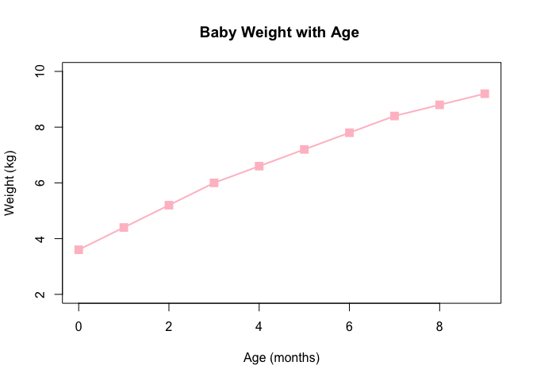
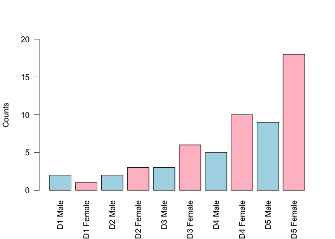

Class 5: Data Visualization and Graphs in R
================

## Data Visualization and graphs in R

``` r
plot(1:10, col="blue", typ="o")
```

<!-- -->

# Section 2: Customizing plots

Need to import/read input data file first

``` r
baby <- read.table("bimm143_05_rstats/weight_chart.txt", header = TRUE)
```

A basic plot of age vs weight

``` r
plot(baby$Age, baby$Weight, type = "o", col="pink",
    pch = 15, cex = 1.5, lwd = 2, ylim = c(2,10),
    xlab = "Age (months)", ylab = "Weight (kg)",
    main = "Baby Weight with Age ")
```

<!-- -->

Import features\_count.txt
file

``` r
mouse <- read.table("bimm143_05_rstats/feature_counts.txt", header = TRUE, sep = "\t")
```

Plot mouse data (counts only) into
barplot

``` r
par(mar = c(3, 12, 4, 2), las=1) #mar sets margins to fit plot, las sets ylabels horizontal
barplot(mouse$Count, horiz=TRUE, names.arg = mouse$Feature, xlim = c(0, 80000), main = "Number of Features in the Mouse GRCm38 Genome")
```

<!-- -->

# Section 3: Using color in plots

Import file to plot later

``` r
mf <- read.delim("bimm143_05_rstats/male_female_counts.txt")
```

Plot data into barplot with all bars different colors using rainbow()

``` r
par(mar=c(7,4,2,2))
barplot(mf$Count, las=2, ylab = "Counts", names.arg = mf$Sample, ylim = c(0,20), col= rainbow(nrow(mf)))
```

<!-- -->

Plot data with alternating colors for
male/female

``` r
barplot(mf$Count, las=2, ylab = "Counts", names.arg = mf$Sample, ylim = c(0,20), col= c("lightblue","pink"))
```

<!-- -->
