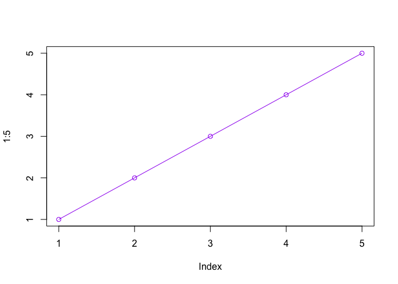
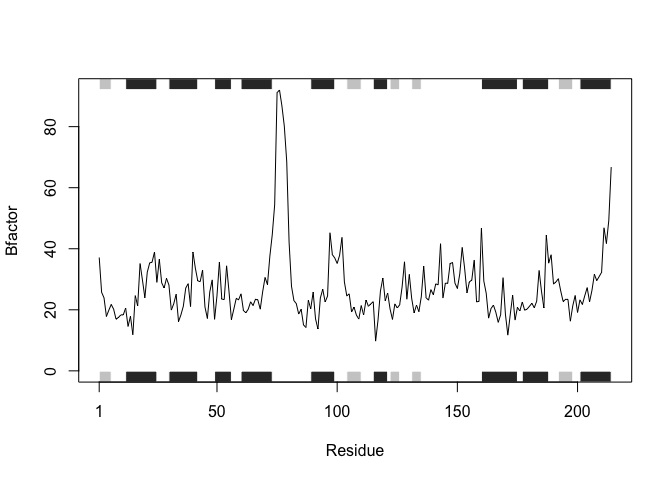
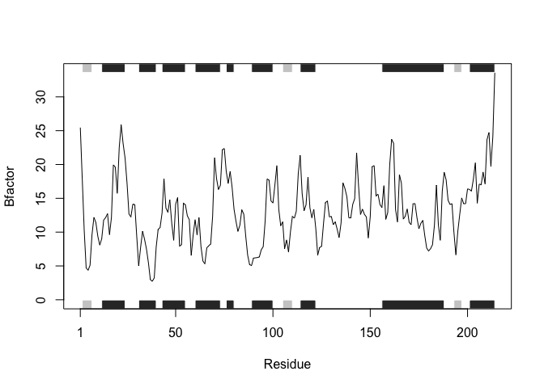
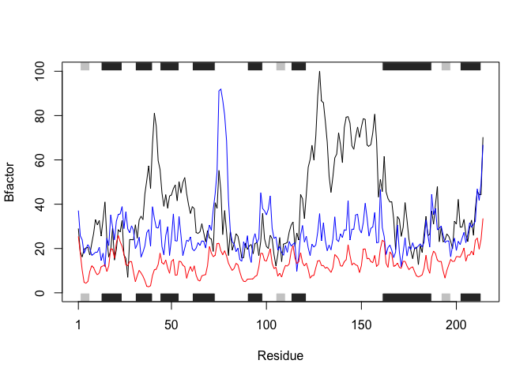
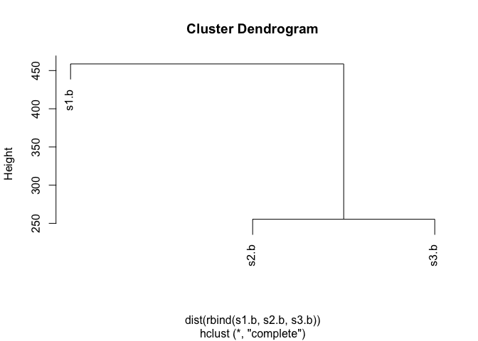

Class 6: R Functions
================
Larissa Rapadas
1/23/2020

``` r
#this is a silly plot
plot (1:5, col= "purple", typ="o")
```

<!-- -->

Let’s see more about **file import** (i.e. reading files into R). The
main read function in base R is `read.table()`

``` r
read.csv("test1.txt") #by default has comma-separated values and headers
```

    ##   Col1 Col2 Col3
    ## 1    1    2    3
    ## 2    4    5    6
    ## 3    7    8    9
    ## 4    a    b    c

``` r
read.csv("test2.txt", sep="$") #has headers but is separated by "$"
```

    ##   Col1 Col2 Col3
    ## 1    1    2    3
    ## 2    4    5    6
    ## 3    7    8    9
    ## 4    a    b    c

``` r
read.table("test3.txt") #by default has space-separated values and NO headers
```

    ##   V1 V2 V3
    ## 1  1  6  a
    ## 2  2  7  b
    ## 3  3  8  c
    ## 4  4  9  d
    ## 5  5 10  e

# Functions

Our first example function:

``` r
add <- function(x, y=1) {
  #Sum the input of x and y
  x + y
}
```

Let’s try using this function

``` r
add(1)
```

    ## [1] 2

``` r
add(7,3)
```

    ## [1] 10

Let’s see how this works with vectors as
input:

``` r
add(c(1,2,3)) #adds 1 to each element to vector c
```

    ## [1] 2 3 4

``` r
add(c(1,2,3), 4) #adds 4 to each element to vector c
```

    ## [1] 5 6 7

``` r
add(c(1,2,3), c(1,2,3)) #adds each element to the corresponding vector elements
```

    ## [1] 2 4 6

What is this `range()` function you speak of?

``` r
x <- c(4,4,10,3,11)
max(x)
```

    ## [1] 11

``` r
min(x)
```

    ## [1] 3

``` r
range(x)
```

    ## [1]  3 11

# This is our second function:

You need a “name”, “arguments” and “body”…

``` r
rescale <- function(x) {
 rng <-range(x)
 (x - rng[1]) / (rng[2] - rng[1])
}
```

## Test on a small example where you know the answer

``` r
rescale(1:10)
```

    ##  [1] 0.0000000 0.1111111 0.2222222 0.3333333 0.4444444 0.5555556 0.6666667
    ##  [8] 0.7777778 0.8888889 1.0000000

## How would you get your function to work here…

``` r
rescale(c(1,2,NA,3,10))
```

    ## [1] NA NA NA NA NA

Because we haven’t set our function to omit NA’s, we must argue with the
function to do so

``` r
rescale2 <- function(x) {
 rng <-range(x, na.rm=TRUE)
 (x - rng[1]) / (rng[2] - rng[1])
}
rescale2(x)
```

    ## [1] 0.125 0.125 0.875 0.000 1.000

Now that we have done so, our previous function call should now work,
omitting our NA input

``` r
x <- rescale2(c(1,2,NA,3,10))
```

``` r
rescale3 <- function(x, na.rm=TRUE, plot=FALSE) {
 rng <-range(x, na.rm=na.rm)
 print("Hello")
 answer <- (x - rng[1]) / (rng[2] - rng[1])
 return(answer)
 print("is it me you are looking for?")
 if(plot) {
 plot(answer, typ="b", lwd=4)
 }
 print("I can see it in ...")
 return(answer)
}
```

``` r
rescale3(x)
```

    ## [1] "Hello"

    ## [1] 0.0000000 0.1111111        NA 0.2222222 1.0000000

\#Hands-on Section B

``` r
# Can you improve this analysis code?
library(bio3d)
s1 <- read.pdb("4AKE") # kinase with drug
```

    ##   Note: Accessing on-line PDB file

``` r
s2 <- read.pdb("1AKE") # kinase no drug
```

    ##   Note: Accessing on-line PDB file
    ##    PDB has ALT records, taking A only, rm.alt=TRUE

``` r
s3 <- read.pdb("1E4Y") # kinase with drug
```

    ##   Note: Accessing on-line PDB file

``` r
s1.chainA <- trim.pdb(s1, chain="A", elety="CA")
s2.chainA <- trim.pdb(s2, chain="A", elety="CA")
s3.chainA <- trim.pdb(s3, chain="A", elety="CA")

s1.b <- s1.chainA$atom$b
s2.b <- s2.chainA$atom$b
s3.b <- s3.chainA$atom$b

plotb3(s1.b, sse=s1.chainA, typ="l", ylab="Bfactor")
```

<!-- -->

``` r
plotb3(s2.b, sse=s2.chainA, typ="l", ylab="Bfactor")
```

<!-- -->

``` r
plotb3(s3.b, sse=s3.chainA, typ="l", ylab="Bfactor")
```

<!-- -->

**Q1.** What type of object is returned from the `read.pdb()` function?
- Returns a large list of 8 things and of class “pdb” and “sse”

``` r
class(s1)
```

    ## [1] "pdb" "sse"

``` r
str(s1)
```

    ## List of 8
    ##  $ atom  :'data.frame':  3459 obs. of  16 variables:
    ##   ..$ type  : chr [1:3459] "ATOM" "ATOM" "ATOM" "ATOM" ...
    ##   ..$ eleno : int [1:3459] 1 2 3 4 5 6 7 8 9 10 ...
    ##   ..$ elety : chr [1:3459] "N" "CA" "C" "O" ...
    ##   ..$ alt   : chr [1:3459] NA NA NA NA ...
    ##   ..$ resid : chr [1:3459] "MET" "MET" "MET" "MET" ...
    ##   ..$ chain : chr [1:3459] "A" "A" "A" "A" ...
    ##   ..$ resno : int [1:3459] 1 1 1 1 1 1 1 1 2 2 ...
    ##   ..$ insert: chr [1:3459] NA NA NA NA ...
    ##   ..$ x     : num [1:3459] -10.93 -9.9 -9.17 -9.8 -10.59 ...
    ##   ..$ y     : num [1:3459] -24.9 -24.4 -23.3 -22.3 -24 ...
    ##   ..$ z     : num [1:3459] -9.52 -10.48 -9.81 -9.35 -11.77 ...
    ##   ..$ o     : num [1:3459] 1 1 1 1 1 1 1 1 1 1 ...
    ##   ..$ b     : num [1:3459] 41.5 29 27.9 26.4 34.2 ...
    ##   ..$ segid : chr [1:3459] NA NA NA NA ...
    ##   ..$ elesy : chr [1:3459] "N" "C" "C" "O" ...
    ##   ..$ charge: chr [1:3459] NA NA NA NA ...
    ##  $ xyz   : 'xyz' num [1, 1:10377] -10.93 -24.89 -9.52 -9.9 -24.42 ...
    ##  $ seqres: Named chr [1:428] "MET" "ARG" "ILE" "ILE" ...
    ##   ..- attr(*, "names")= chr [1:428] "A" "A" "A" "A" ...
    ##  $ helix :List of 4
    ##   ..$ start: Named num [1:19] 13 31 44 61 75 90 113 161 202 13 ...
    ##   .. ..- attr(*, "names")= chr [1:19] "" "" "" "" ...
    ##   ..$ end  : Named num [1:19] 24 40 54 73 77 98 121 187 213 24 ...
    ##   .. ..- attr(*, "names")= chr [1:19] "" "" "" "" ...
    ##   ..$ chain: chr [1:19] "A" "A" "A" "A" ...
    ##   ..$ type : chr [1:19] "5" "1" "1" "1" ...
    ##  $ sheet :List of 4
    ##   ..$ start: Named num [1:14] 192 105 2 81 27 123 131 192 105 2 ...
    ##   .. ..- attr(*, "names")= chr [1:14] "" "" "" "" ...
    ##   ..$ end  : Named num [1:14] 197 110 7 84 29 126 134 197 110 7 ...
    ##   .. ..- attr(*, "names")= chr [1:14] "" "" "" "" ...
    ##   ..$ chain: chr [1:14] "A" "A" "A" "A" ...
    ##   ..$ sense: chr [1:14] "0" "1" "1" "1" ...
    ##  $ calpha: logi [1:3459] FALSE TRUE FALSE FALSE FALSE FALSE ...
    ##  $ remark:List of 1
    ##   ..$ biomat:List of 4
    ##   .. ..$ num   : int 1
    ##   .. ..$ chain :List of 1
    ##   .. .. ..$ : chr [1:2] "A" "B"
    ##   .. ..$ mat   :List of 1
    ##   .. .. ..$ :List of 1
    ##   .. .. .. ..$ A B: num [1:3, 1:4] 1 0 0 0 1 0 0 0 1 0 ...
    ##   .. ..$ method: chr "AUTHOR"
    ##  $ call  : language read.pdb(file = "4AKE")
    ##  - attr(*, "class")= chr [1:2] "pdb" "sse"

**Q2.** What does the trim.pdb() function do? - Trims the previously
read pdb file. Creates a new PDB object based on a subset of
atoms

## **Q3.** What input parameter would turn off the marginal black and grey rectangles in the plots and what do they represent in this case?

**Q4.** What would be a better plot to compare across the different
proteins? - Combine the three separate plots into one for easier
comparison of lines

``` r
plotb3(s1.b, sse=s1.chainA, typ="l", ylab="Bfactor")
points(s2.b, typ="l", col="blue", lwd=1)
points(s3.b, typ="l", col="red", lwd=1) 
```

<!-- -->

**Q5.** Which proteins are more similar to each other in their B-factor
trends. How could you quantify this? - With a cluster dendrogram. This
quantifies the distance between the the rows of the three different
vectors below.

``` r
hc <- hclust( dist( rbind(s1.b, s2.b, s3.b) ) )
plot(hc)
```

<!-- -->

**Q6.** How would you generalize the original code above to work with
any set of input protein structures? c(read.pdb(“4AKE”),)
