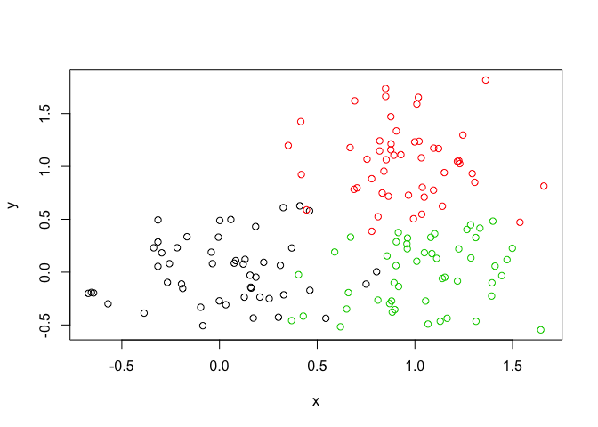

class09
================
Larissa Rapadas
2/4/2020

## Introduction to Machine Learning for Bioinformatics

### K-Means Clustering

``` r
# Generate some example data for clustering
tmp <- c(rnorm(30,-3), rnorm(30,3))
x <- cbind(x=tmp, y=rev(tmp))
plot(x)
```

<!-- -->

Use the kmeans() function setting k to 2 and nstart=20

``` r
km <- kmeans (x, centers=2, nstart=20)
```

#### Inspect/print the results

**Q. How many points are in each cluster?** *There are 30 points in each
cluster*

**Q. What ‘component’ of your result object details**

**- cluster size?** *size*

**- cluster assignment/membership?** *cluster*

**- cluster center?** *centers*

#### Plot x colored by the kmeans cluster assignment and

Add cluster centers as blue points

``` r
 plot(x, col = km$cluster+65)
points(km$centers, col = "blue", pch=15)
```

<!-- -->

### Hierarchical Clustering

• Number of clusters is not known ahead of time

• Two kinds of hierarchical clustering:

➡ bottom-up

➡ top-down

An important point here is that you ave to calculate the distance from
your input data before calling `hclust()`.

``` r
# First we need to calculate point (dis)similarity
# as the Euclidean distance between observations
dist <- dist(x)

# The hclust() function returns a hierarchical
# clustering model

hc <- hclust(d = dist)
# the print method is not so useful here
hc
```

    ## 
    ## Call:
    ## hclust(d = dist)
    ## 
    ## Cluster method   : complete 
    ## Distance         : euclidean 
    ## Number of objects: 60

Plotting this data is much more useful:

``` r
plot(hc)
```

<!-- -->

This outputs a **cluster dendrogram**: A dendrogram is a tree-shaped
structure used to interpret hierarchical clustering models

``` r
plot(hc)
abline(h=6, col="red", lty=2)
abline(h=3.5, col="blue", lty=2)
```

<!-- --> To get the
cluster membership vector, I need to “cut the tree” at a certain height
to yield my separate cluster
    branches

``` r
cutree(hc, h=6) # Cut by height h
```

    ##  [1] 1 1 1 1 1 1 1 1 1 1 1 1 1 1 1 1 1 1 1 1 1 1 1 1 1 1 1 1 1 1 2 2 2 2 2 2 2 2
    ## [39] 2 2 2 2 2 2 2 2 2 2 2 2 2 2 2 2 2 2 2 2 2 2

``` r
gp4 <- cutree(hc, h=4)
table (gp4)
```

    ## gp4
    ##  1  2  3  4  5  6 
    ## 13 15  2 15 13  2

We can also cut the tree according to k groups, if you do not know at
what height to split the
    clusters

``` r
cutree(hc, k=2 ) # Cut into k grps
```

    ##  [1] 1 1 1 1 1 1 1 1 1 1 1 1 1 1 1 1 1 1 1 1 1 1 1 1 1 1 1 1 1 1 2 2 2 2 2 2 2 2
    ## [39] 2 2 2 2 2 2 2 2 2 2 2 2 2 2 2 2 2 2 2 2 2 2

We can try different linkage methods for organizing the clusters in R

``` r
# Using different hierarchical clustering methods
hc.complete <- hclust(dist, method="complete")
plot(hc.complete)
```

<!-- -->

``` r
hc.average <- hclust(dist, method="average")
plot(hc.average)
```

<!-- -->

``` r
hc.single <- hclust(dist, method="single")
plot(hc.single)
```

<!-- -->

``` r
# Step 1. Generate some example data for clustering
x <- rbind(
 matrix(rnorm(100, mean=0, sd = 0.3), ncol = 2), # c1
 matrix(rnorm(100, mean = 1, sd = 0.3), ncol = 2), # c2
 matrix(c(rnorm(50, mean = 1, sd = 0.3), # c3
 rnorm(50, mean = 0, sd = 0.3)), ncol = 2))
colnames(x) <- c("x", "y")
# Step 2. Plot the data without clustering
plot(x)
```

<!-- -->

``` r
# Step 3. Generate colors for known clusters
# (just so we can compare to hclust results)
col <- as.factor( rep(c("c1","c2","c3"), each=50) )
plot(x, col=col)
```

<!-- -->

``` r
length(x)
```

    ## [1] 300

**Q. Use the dist(), hclust(), plot() and cutree() functions to return 2
and 3 clusters**

``` r
d <- dist(x)
hc2 <- hclust(d) 
plot(hc2)
```

<!-- -->

``` r
plot(hc2)
abline(h=6, col="red", lty=2)
cutree(hc2, k=2)
```

    ##   [1] 1 1 1 1 1 1 1 1 1 1 1 1 1 1 1 1 1 1 1 1 1 1 1 1 2 1 1 1 1 1 1 1 1 2 1 2 1
    ##  [38] 1 1 1 1 1 1 1 1 1 1 1 1 1 2 2 2 2 2 2 2 2 2 2 2 2 2 2 2 2 2 2 2 2 2 2 2 2
    ##  [75] 2 2 2 2 2 2 2 2 2 1 2 2 2 2 2 2 1 2 1 2 2 2 2 2 2 2 1 1 1 1 1 1 1 1 1 1 1
    ## [112] 1 1 1 1 1 1 1 1 1 1 1 1 1 1 1 1 1 1 1 1 1 1 1 1 1 1 1 1 1 1 1 1 1 1 1 1 1
    ## [149] 1 1

``` r
abline(h=6, col="red", lty=2)
```

<!-- -->

``` r
grps <- cutree(hc2, k=3)
table (grps)
```

    ## grps
    ##  1  2  3 
    ## 60 50 40

**Q. How does this compare to your known ‘col’ groups?**

``` r
plot(x, col=grps)
```

<!-- --> \#\#
Principal Component Analysis (PCA)

PCA converts the correlations (or lack thereof) among all cells into a
representation we can more readily interpret (e.g. a 2D graph\!)

The PCs (i.e. new plot axis) are ranked by their importance. So PC1 is
more important than PC2 which in turn is more important than PC3, etc.

The PCs (i.e. new plot axis) are ranked by the amount of variance in the
original data (i.e. gene expression values) that they “capture”

## Hands-on with PCA

``` r
x <- read.csv("UK_foods.csv", row.names = 1)
x
```

    ##                     England Wales Scotland N.Ireland
    ## Cheese                  105   103      103        66
    ## Carcass_meat            245   227      242       267
    ## Other_meat              685   803      750       586
    ## Fish                    147   160      122        93
    ## Fats_and_oils           193   235      184       209
    ## Sugars                  156   175      147       139
    ## Fresh_potatoes          720   874      566      1033
    ## Fresh_Veg               253   265      171       143
    ## Other_Veg               488   570      418       355
    ## Processed_potatoes      198   203      220       187
    ## Processed_Veg           360   365      337       334
    ## Fresh_fruit            1102  1137      957       674
    ## Cereals                1472  1582     1462      1494
    ## Beverages                57    73       53        47
    ## Soft_drinks            1374  1256     1572      1506
    ## Alcoholic_drinks        375   475      458       135
    ## Confectionery            54    64       62        41

``` r
dim(x) # this prints out a vector of rows columns
```

    ## [1] 17  4

# Spotting major differences and trends

``` r
barplot(as.matrix(x), beside=T, col=rainbow(nrow(x)))
```

<!-- -->

``` r
pairs(x, col=rainbow(10), pch=16)
```

<!-- -->

``` r
# Use the prcomp() PCA function 
pca <- prcomp( t(x) )
summary(pca)
```

    ## Importance of components:
    ##                             PC1      PC2      PC3       PC4
    ## Standard deviation     324.1502 212.7478 73.87622 4.189e-14
    ## Proportion of Variance   0.6744   0.2905  0.03503 0.000e+00
    ## Cumulative Proportion    0.6744   0.9650  1.00000 1.000e+00

What’s in my result object `pca`? I can check the attributes:

``` r
attributes(pca)
```

    ## $names
    ## [1] "sdev"     "rotation" "center"   "scale"    "x"       
    ## 
    ## $class
    ## [1] "prcomp"

Plot PC1 vs PC2

``` r
plot (pca$x[,1], pca$x[,2], 
      xlab="PC1", ylab="PC2", # Label the axes
      xlim=c(-270,500)) # Range in x

# Label the plot points to find out what countries represent which data points
text(pca$x[,1], pca$x[,2], colnames(x), col=c("grey","red","blue","darkgreen"))
```

<!-- --> Now we want
to find out what makes N. Ireland so different from the other three
countries
