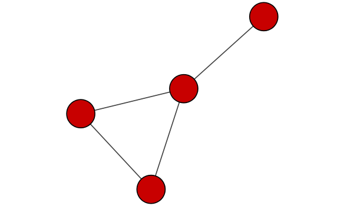
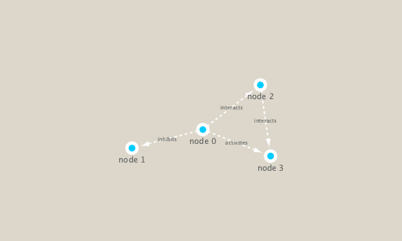

```{r setup, include=FALSE}
knitr::opts_chunk$set(echo = TRUE)
```

## About our data
In this analysis we are using a Tara Ocean data and we have data from the bacterial dataset (Sunagawa et al. 2015) and also from the viral dataset (Brum et al. 2015). They have been examined in Lima-Mendez et al. (2015) and we have used the original relative abundances to visualize the data. Data were retrieved from: http://www.raeslab.org/companion/ocean-interactome.html

First, we install `igraph` from CRAN and `RCy3` from Bioconductor. We can do this in the console.

Now let's load the packages into our workspace.
```{r}
library(RCy3)
library(igraph)
library(RColorBrewer)
```

```{r}
# Test the connection to Cytoscape.
cytoscapePing()
```
```{r}
# Check the version
cytoscapeVersionInfo()
```

## Make a simple igraph

```{r}
g <- makeSimpleIgraph()
createNetworkFromIgraph(g,"myGraph")
```

```{r}
fig <- exportImage(filename="demo", type="png", height=350)

```

```{r}


```

```{r}
setVisualStyle("Marquee")

```

```{r}
fig <- exportImage(filename="demo_marquee", type="png", height=350)



```

```{r}
styles <- getVisualStyleNames()
styles

```

```{r}
plot (g)
```
```{r}
## scripts for processing located in "inst/data-raw/"
prok_vir_cor <- read.delim("./data/virus_prok_cor_abundant.tsv", stringsAsFactors = FALSE)

## Have a peak at the first 6 rows
head(prok_vir_cor)
```
How many connects (i.e. edges) will we have in our network? Let's look at the number of rows.
```{r}
nrow(prok_vir_cor)
```

Use the igraph function to make a network from this data.frame:
```{r}
g <- graph.data.frame(prok_vir_cor, directed = FALSE)
class(g)
g
```

```{r}
plot(g)
```

```{r}
plot(g, vertex.label=NA)

```

```{r}
plot(g, vertex.size=3, vertex.label=NA)
```

```{r}
library(ggplot2)
library(ggraph)

```
```{r}
ggraph(g, layout = 'auto') +
  geom_edge_link(alpha = 0.25) +
  geom_node_point(color="steelblue") +
  theme_graph()
```

